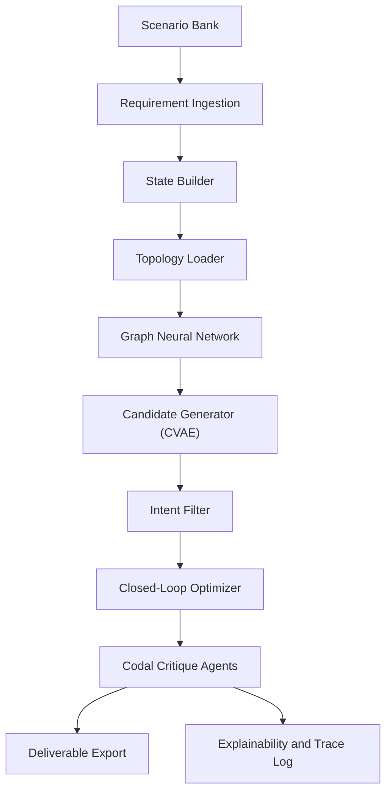

# High-Level Design: PINNFlow

## 1. Executive Summary

PINNFlow is a scenario-driven engineering intelligence pipeline that transforms industrial requirements into validated design artifacts. The system is built around a sequence of data and model handoffs rather than a single monolithic predictor.

At a high level, the platform combines:

- scenario synthesis
- requirement extraction
- graph-based topology understanding
- conditional generative modeling
- reinforcement-learning refinement
- codal compliance evaluation
- traceable deliverable export

The design is intentionally modular so that each stage can be studied, swapped, benchmarked, or ablated independently.

## 2. Architectural Goals

The architecture is optimized for five goals:

1. Preserve scenario context from the start of the workflow to the final report.
2. Convert mixed-format engineering inputs into a structured numerical state.
3. Use fast surrogate models to reduce dependence on repeated simulation.
4. Enforce engineering constraints during both generation and optimization.
5. Produce auditable outputs that are suitable for review and comparison.

## 3. System Overview

## 4. Major Subsystems

### 4.1 Scenario Management

The scenario bank defines controlled operating cases such as:

- `high_pressure_gas`
- `refinery_compliance`
- `deep_sea_fsi`
- `refinery_congested`
- `extreme_conditions`

Each scenario provides:

- pressure range
- temperature range
- topology identifier
- optional penalties or tags such as `fsi` and `congested`

This layer gives the project a structured experimental design and ensures that all downstream models receive consistent context.

### 4.2 Requirement Ingestion

The ingestion layer converts raw scenario context into a machine-readable schema with:

- pipe line definitions
- equipment summaries
- code constraints
- scenario metadata

From a data-science standpoint, this stage is a feature extraction and schema-normalization problem.

### 4.3 Topology Modeling

Topology is modeled using a graph pipeline:

- a graph loader maps a network source into node and edge tensors
- `GasNetworkGNN` converts those tensors into flow and pressure summaries

These topology summaries condition later candidate scoring and help the system adapt to different network regimes.

### 4.4 Generative Design

`CAVAE` is the design proposal engine. It generates candidate 10-dimensional states conditioned on:

- scenario inputs
- derived engineering context
- topology summaries

The generative stage is not a free-form design tool. It is constrained by:

- bounding rules
- physical plausibility
- discrete geometry handling
- downstream scoring against the PINN

### 4.5 Intent and Heuristics

The intent engine provides engineering-aware filtering before optimization. It acts as a lightweight rule layer that:

- snaps dimensions to realistic standards
- rejects incompatible layouts
- ranks candidates using a mix of physics and topology signals

This is important because not every generated layout should proceed to the expensive refinement stage.

### 4.6 Closed-Loop Optimization

The closed-loop optimizer combines:

- `PPOAgent` policy actions
- environment reward shaping
- PINN-based stress estimates
- codal guidance from critique agents

This stage is the decision-making core of the system. It improves the selected candidate under operational constraints rather than optimizing a single loss in isolation.

### 4.7 Codal Intelligence

The codal engine provides standards-aware critique using rule retrieval and agents such as:

- `ASMEB31Agent`
- `API14EAgent`

The wrapper injects penalties and compliance signals into the environment so that the RL loop can optimize with safety context.

### 4.8 Deliverables and Traceability

The final stage converts the optimized design into:

- bill of materials
- isometric JSON
- compliance matrix
- trace report

These outputs make the workflow reproducible and reviewable.

## 5. Information Contracts

### 5.1 Scenario Contract

Each scenario contains:

- `scenario_name`
- `inputs`
- `meta`

Important fields include:

- `inputs.max_p`
- `inputs.max_t`
- `inputs.topology`
- `meta.congested`
- `meta.fsi`
- `meta.codal_penalty_weight`

### 5.2 State Contract

The central state vector has 10 dimensions:

1. diameter
2. thickness
3. length
4. pressure
5. soil displacement
6. delta T
7. velocity
8. soil stiffness
9. shape ID
10. shape parameter

The state is the main interface between generation, optimization, and deliverables.

### 5.3 Artifact Contract

The deliverable layer writes per-design outputs under a stable design ID. This enables:

- scenario-by-scenario comparison
- rerun traceability
- artifact retention for audit

## 6. Deployment and Runtime Considerations

The system is primarily a research and benchmarking stack, but the architecture supports gradual production hardening:

- caching and persistence for codal rule loading
- deterministic seeding for reproducibility
- scenario-aware output directories
- richer validation callbacks in the closed-loop optimizer
- dashboard-based inspection of outputs and traces

## 7. Risks and Design Constraints

The main architectural risks are:

- over-reliance on surrogate predictions without independent validation
- scenario inputs not being propagated consistently
- discrete geometry fields being treated as continuous values
- artifact overwrites if design IDs are reused

These are the main reasons the project benefits from strong tests, scenario logs, and a trace-first design.

## 8. Summary

PINNFlow is best understood as a staged ML system for industrial decision support. It is not only a model, but a workflow:

- context in
- structured state out
- candidate design in
- optimized, compliant deliverables out

