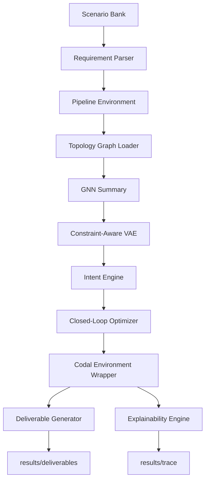

# PINNFlow

PINNFlow is an end-to-end industrial design and verification research stack that combines scenario ingestion, topology-aware graph modeling, generative design, reinforcement-learning refinement, physics-based scoring, codal compliance checks, and automated deliverable generation.

This repository is organized around a data-science workflow rather than a single model:

- ingest structured and semi-structured scenario information
- convert it into a stable numerical state representation
- score network topology with a graph neural network
- generate candidate designs with a constraint-aware VAE
- refine candidates with a closed-loop RL optimizer
- validate results with physics and code-aware rules
- export BOM, isometric, compliance, and traceability artifacts

## What This Project Is For

The project is designed for engineering analytics and design optimization tasks where the goal is not just prediction, but decision support under physical and regulatory constraints. It is especially useful when you need:

- scenario-conditioned design generation
- fast surrogate evaluation instead of repeated expensive simulation
- compliance-aware optimization
- traceable outputs for review and audit
- a reproducible benchmark harness for ablation and scenario studies

## Core Idea

The pipeline treats industrial design as a multi-stage learning problem:

1. A scenario bank defines representative operating cases such as high-pressure gas, refinery compliance, and deep-sea FSI conditions.
2. The ingestion layer turns raw text context into a structured schema.
3. The environment maps that schema into a 10-dimensional design state.
4. A graph model summarizes network topology and flow context.
5. A conditional VAE proposes candidate layouts.
6. The intent engine filters candidates using engineering heuristics.
7. A closed-loop optimizer refines the selected state with RL and physics scores.
8. Critique agents apply codal penalties and compliance scoring.
9. Deliverables and trace logs are written to `results/`.

## Repository Layout

- `main.py` or `LLD/main.py`: entry point for the full industrial suite
- `pinnflow/`: main package
- `pinnflow/scenarios/`: synthetic scenario bank and case definitions
- `pinnflow/ingestion/`: structured requirement parsing
- `pinnflow/gnn/`: topology loading and graph neural network logic
- `pinnflow/vae.py`: constraint-aware generative design model
- `pinnflow/environment.py`: optimization environment and reward shaping
- `pinnflow/codal_engine/`: standards knowledge, critique agents, and compliance wrapper
- `pinnflow/closed_loop/`: iterative refinement loop
- `pinnflow/deliverables/`: BOM, ISO, and compliance exports
- `pinnflow/explainability/`: trace capture and human-readable reporting
- `tests/`: unit and integration coverage
- `results/`: generated reports, CSVs, JSON traces, and plots

## Main Data Flow



## Data Science View

From a data-science perspective, the repo contains four main modeling layers:

- `Physics surrogate`: `MultiTaskPINN` approximates stress and pressure-drop behavior.
- `Topology model`: `GasNetworkGNN` summarizes network structure and flow context.
- `Generative model`: `CAVAE` proposes design candidates conditioned on scenario metadata.
- `Policy model`: `PPOAgent` and the closed-loop optimizer refine designs under reward shaping.

This makes the project useful for studying:

- surrogate modeling
- constrained generation
- multi-objective optimization
- reward shaping
- simulation-to-decision pipelines
- explainable ML for engineering systems

## Outputs

The default run produces scenario-specific artifacts in `results/`:

- `results/deliverables/<design_id>/BOM_<design_id>.csv`
- `results/deliverables/<design_id>/ISO_<design_id>.json`
- `results/deliverables/<design_id>/Compliance_Matrix_<design_id>.csv`
- `results/trace/TRACE_<design_id>.json`
- benchmark summaries, plots, and ablation tables when those scripts are executed

## How To Run

Install dependencies and run the main suite from the project root:

```bash
pip install -r requirements.txt
python LLD/main.py
```

The orchestrator can also be run directly:

```bash
python -m pinnflow.orchestrator_v2
```

## Testing

Run the full test suite:

```bash
python -m pytest tests/
```

Good smoke tests for the full flow:

```bash
python tests/test_phase1.py
python tests/test_phase2.py
python tests/test_phase3.py
python tests/test_codal_e2e.py
```

## Configuration

Environment variables used by `main.py`:

- `PINNFLOW_TRAIN_CVAE`
- `PINNFLOW_CVAE_EPOCHS`
- `PINNFLOW_CVAE_SAMPLES_PER_SCENARIO`
- `PINNFLOW_CVAE_SCENARIOS`

These control whether the CVAE is trained at startup, how many epochs it runs, and which scenarios are used to build the training set.

## Practical Notes

- The project uses scenario-conditioned synthetic data, so results are meant for reproducible experimentation and workflow validation.
- The code writes multiple generated artifacts. Re-running a case will overwrite files for the same `design_id`.
- The trace and deliverable directories are part of the research output and should be retained when comparing runs.

## Recommended Reading Order

If you are onboarding into the repo, read these files in sequence:

1. `HLD.md`
2. `LLD.md`
3. `methodology.md`
4. `process_flow_guide.md`
5. `paper_methodology.md`

