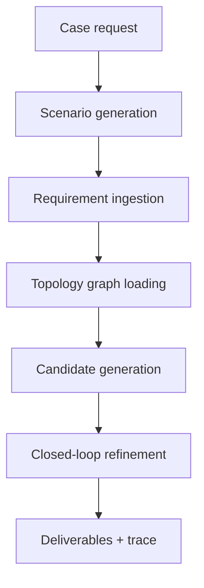

# Process Flow and Data Architecture Guide

This guide walks through the execution flow of PINNFlow from input to output. It is written as a practical debugging and data-hand-off reference.

## 1. Boot Sequence

The typical startup sequence is:

1. `main.py` creates `UnifiedOrchestrator`
2. the orchestrator instantiates the PINN, CVAE, PPO agent, base environment, and codal wrapper
3. standards documents are loaded into the rule store
4. the CVAE and PINN are warmed up with initial collocation samples
5. scenarios are executed one by one

At this stage, the system has all of the following in memory:

- surrogate model
- generative model
- policy model
- compliance knowledge base
- deliverable generator
- trace engine

## 2. End-To-End Case Flow

The orchestrator runs a case through six phases.

## 3. Phase-by-Phase Walkthrough

### 3.1 Phase 1: Scenario and Ingestion

Input:

- `case_name`

Main outputs:

- `scenario`
- `ingested`

What happens:

- the scenario bank creates a named case with pressure, temperature, and topology context
- the ingestion parser converts raw case text into a schema
- the parser builds line data, equipment data, and constraints
- a PINN-based validation pass scores the extracted schema

Why this matters:

- it turns an abstract case into structured ML-ready data
- it gives later stages a stable schema to build from

### 3.2 Phase 2: Topology Analysis

Input:

- topology source from the scenario

Main outputs:

- graph tensors
- node pressure summaries
- flow summaries

What happens:

- the graph loader resolves the topology
- the GNN processes the graph
- summary statistics are stored in the case context

Why this matters:

- topology can influence both design feasibility and candidate ranking
- graph summaries compact network context into a few useful signals

### 3.3 Phase 3: Candidate Generation and Ranking

Inputs:

- `scenario`
- `ingested.schema`
- topology summaries

Main outputs:

- candidate layouts
- best design state
- candidate ranking table

What happens:

- the environment builds a seed state from the scenario
- the VAE generates multiple candidate states
- heuristic rules clean and normalize each candidate
- the intent engine scores the candidates

Why this matters:

- generation should not be random exploration
- each candidate is conditioned on scenario context and screened before optimization

### 3.4 Phase 4: Compliance-Aware Reward Setup

Input:

- scenario metadata

What happens:

- the wrapper receives a scenario-specific codal penalty weight
- the compliance layer is prepared to modify rewards during refinement

Why this matters:

- the reward function becomes domain-aware instead of purely numerical
- compliance acts as a first-class signal in optimization

### 3.5 Phase 5: Closed-Loop Refinement

Inputs:

- best design state
- base environment
- RL agent

Main outputs:

- final state
- convergence history
- final metrics

What happens:

- the optimizer seeds the environment
- the agent proposes actions
- the environment steps forward
- the PINN estimates stress and pressure-drop proxies
- codal agents add penalties and recommendations
- the loop continues until convergence or max iterations

Key stored metrics:

- `sigma`
- `delta_P`
- `fatigue`
- `cost`
- `compliance_score`
- `codal_report`

### 3.6 Phase 6: Deliverables and Traceability

Inputs:

- optimized state
- optimization metrics
- scenario context

Main outputs:

- BOM CSV
- ISO JSON
- compliance matrix CSV
- trace JSON
- human-readable report object

What happens:

- deliverables are written under a design-specific output directory
- trace decisions are exported to JSON
- a final explanation object summarizes the case

## 4. Central Data Objects

### 4.1 Scenario

Created by `ScenarioBank.generate_scenario()`.

Important fields:

- `scenario_name`
- `inputs`
- `meta`

### 4.2 Ingested Schema

Created by `RequirementParser.run_e2e()`.

Important fields:

- `schema.lines`
- `schema.equipment`
- `schema.constraints`
- `validation.report`

### 4.3 Candidate State

Created and refined by the VAE, intent engine, and optimizer.

Important fields:

- numeric geometry and operating values
- discrete geometry ID
- geometry parameter

### 4.4 Metrics

Created by the environment and wrapper.

Important fields:

- `sigma`
- `delta_P`
- `cost`
- `violation`
- `compliance_score`
- `codal_report`

### 4.5 Trace and Deliverables

Created by the explanation engine and deliverable generator.

Important fields:

- trace file path
- BOM file path
- ISO file path
- compliance matrix file path

## 5. Debugging Checklist

Use this checklist when a run does not behave as expected:

1. Confirm the scenario bank is generating the intended case.
2. Confirm the ingestion schema contains the expected pressure and temperature values.
3. Confirm the topology loader is using the correct topology source.
4. Confirm candidate states are being sanitized before optimization.
5. Confirm the environment state is seeded with the chosen design.
6. Confirm the wrapper is returning codal penalties and compliance score.
7. Confirm output files are written under the expected design ID.

## 6. Common Failure Modes

### 6.1 Scenario Mismatch

Symptom:

- the run logs one scenario, but outputs appear to use another

Likely cause:

- scenario metadata was not threaded to a downstream stage

### 6.2 Invalid State Values

Symptom:

- generated states contain out-of-range values or non-integer geometry codes

Likely cause:

- sanitization was skipped or the geometry field was treated as continuous

### 6.3 Weak Convergence

Symptom:

- the optimizer runs for the maximum number of iterations without meaningful improvement

Likely cause:

- reward scaling, codal penalties, or state seeding need adjustment

### 6.4 Missing Trace Artifact

Symptom:

- deliverables exist but no trace file is present

Likely cause:

- trace export was not called or the output directory path is incorrect

## 7. Data Architecture Notes

The system is easier to maintain when every phase passes a clearly typed object to the next one. In practice, the most useful abstraction is a case context that stores:

- raw scenario
- parsed schema
- topology summary
- candidate ranking
- selected design
- final metrics
- output paths

That reduces implicit coupling and makes experiments easier to reproduce.

